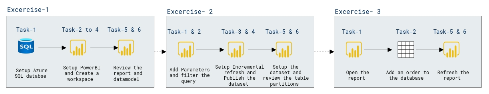

# Lab Scenario Preview: DP-500: Improve performance with hybrid tables

## Lab 10: Improve performance with hybrid tables

### Lab overview

In this lab, you will set up incremental refresh and enable a DirectQuery partition to deliver real time updates and improve refresh and query performance

## Objective
  
After completing this lab, you will be able to:

- Set up incremental refresh
- Review table partitions

## Architecture Diagram

 
