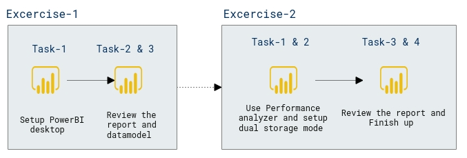

# Lab Scenario Preview: DP-500: Improve query performance with dual storage mode

## Lab 11: Improve query performance with dual storage mode

### Lab overview

In this lab, you will improve the performance of a composite model by setting some tables to use dual storage mode

## Objective
  
After completing this lab, you will be able to:

- Set dual storage mode
- Use Performance analyzer to review refresh activities

## Architecture Diagram

 
