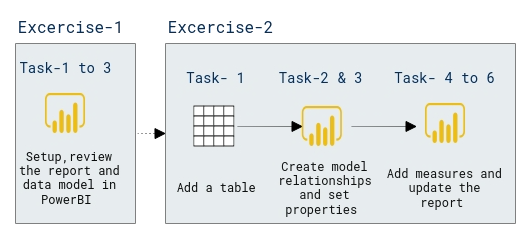

# Lab Scenario Preview: DP-500: Create a composite model

## Lab 08: Create a composite model

### Lab overview

In this lab, you will create a composite model by adding a table to a pre-developed DirectQuery model

## Objective
  
After completing this lab, you will be able to:

- Create a composite model
- Create model relationships
- Create measures

## Architecture Diagram

 
